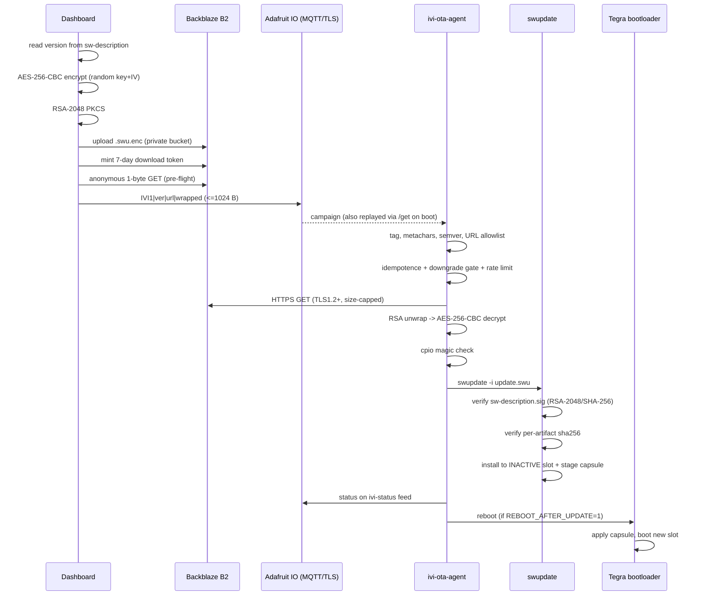

# OTA Security — End-to-End Flow

How a firmware image gets from the Dashboard onto a target and into execution,
and exactly which cryptography is applied at each hop.

There are **three independent OTA paths** in this project. They share a
dashboard, a broker and a design philosophy, but no code and no keys:

| Path | Target | Package | Transport | Trust anchor |
|---|---|---|---|---|
| **IVI** | Jetson Orin NX, Yocto | swupdate `.swu` | B2 + MQTT | `sw-description.sig` (RSA-2048) |
| **Cluster** | QNX guest, IFS image | raw IFS + detached `.sig` | Supabase + MQTT | detached RSA-2048 signature |
| **ECU** | ESP32 (+ STM32 behind it) | MCUboot image | MQTT / CAN | MCUboot image signature |

The single most important idea, stated once and applying to all three:

> **The campaign message is a hint, not an authority.** It says *what* version,
> *where* to fetch it and *which* session key unwraps it. It never decides
> whether to install. Anyone who can publish to the feed can put anything in it.
> Authenticity is decided on the device, by verifying a signature against a key
> that was provisioned out-of-band.

---

## Part 1 — The IVI path (Jetson / Yocto / swupdate)

### 1.1 Build

Yocto produces a `.swu`, which is a **cpio archive** (magic `070701`) whose
first member must be `sw-description`. `meta-vpace` overrides that file
(`recipes-bbappends/swupdate-image-tegra/files/sw-description`) to add a
`sha256 = "$swupdate_get_sha256(...)"` line to **every** image, file and script
entry — `CONFIG_SIGNED_IMAGES` requires it, because the signature covers
`sw-description` only and those hashes are what extends that trust to the
payload.

The descriptor defines an **A/B slot layout**:

- `slot_a` writes to `APP_b` (rootfs tar.gz, kernel, DTB)
- `slot_b` writes to `APP`
- both also stage `tegra-bl.cap` (a UEFI capsule for the Tegra bootloader) and
  an ESP archive onto `/boot/efi`, plus a Lua install script

Nothing installs over the running slot.

### 1.2 Signing — the trust anchor

`recipes-bbappends/swupdate/files/signing.cfg`:

```
CONFIG_SIGNED_IMAGES=y
```

swupdate signs `sw-description`, producing `sw-description.sig` inside the
archive. The verification key is a **bare RSA public key** (PEM
`-----BEGIN PUBLIC KEY-----`, not an X.509 certificate) shipped by
`swupdate-key.bb` to `/usr/share/swupdate/swupdate.pem`, and wired in by
`swupdate-machine-config_1.0.bbappend`, which injects into `swupdate.cfg`:

```
public-key-file = "/usr/share/swupdate/swupdate.pem";
```

**Algorithm:** a bare public key (rather than a certificate) selects swupdate's
`RAWRSA` mode, i.e.

> **RSASSA-PKCS#1 v1.5, SHA-256, RSA-2048**

Not PSS, and not CMS — CMS would require a certificate here.

### 1.3 Encryption — confidentiality only

`Dashboard/ivi/keys/prepare_ivi_image.sh` runs when you select a file in the
Dashboard. RSA cannot encrypt a 53 MiB image (PKCS#1 v1.5 tops out at 245 bytes
for a 2048-bit key), so this is **hybrid encryption**:

```bash
KEY_HEX="$(openssl rand -hex 32)"     # 256-bit AES key
IV_HEX="$(openssl rand -hex 16)"      # 128-bit IV, fresh every upload

openssl enc -aes-256-cbc -in "$SWU" -out "$ENC_FILE" -K "$KEY_HEX" -iv "$IV_HEX"

printf "%s:%s" "$KEY_HEX" "$IV_HEX" \
  | openssl pkeyutl -encrypt -pubin -inkey "$TEMP_PUB" \
  | openssl base64 -A > "$KEY_FILE"
```

| Layer | Algorithm |
|---|---|
| Bulk | **AES-256-CBC**, random key + IV per upload, PKCS#7 padding |
| Key wrap | **RSA-2048, RSAES-PKCS#1 v1.5** — `pkeyutl -encrypt` with no `-pkeyopt rsa_padding_mode`, so it takes OpenSSL's v1.5 default, **not OAEP** |
| Wrapped plaintext | the ASCII string `KEY_HEX:IV_HEX` — 97 bytes, comfortably inside the 245-byte v1.5 limit |
| Encoding | Base64, single line (`-A`) |

Outputs: `<image>.swu.enc` and `<image>.swu.key.enc`.

**What this does not do.** The wrapping key is a *public* key, embedded in a
script that lives in source control. Anyone holding it can generate their own
session key, encrypt their own payload and wrap it correctly. **Successful
decryption proves nothing about origin.** It buys confidentiality on the wire
and in the bucket, and nothing else.

### 1.4 Upload and campaign dispatch

`Dashboard/ivi/ivi_ota.cpp`:

1. Reads the version from the package's own `sw-description`
   (`version = "X.Y.Z";`), scanning the first 64 KB — valid because swupdate
   mandates `sw-description` as the first cpio member. Falls back to a semver in
   the filename. *(Yocto's default names carry a machine id and build timestamp
   but no semver, which is why filename parsing alone once reported `1.0.0` for
   every build.)*
2. Uploads `<image>.swu.enc` to a **private** Backblaze B2 bucket.
3. Mints a download token via `b2_get_download_authorization` (7-day maximum,
   requires the `shareFiles` capability) and appends `?Authorization=<token>`.
   **No storage credential is ever provisioned on the device.**
4. **Pre-flight check:** issues an unauthenticated one-byte range request
   against the exact URL it is about to publish, and refuses to publish a
   campaign the board could not fetch.
5. Publishes to the Adafruit IO feed `ivi-ota` over **MQTT/TLS on port 8883**.

Campaign format (Adafruit IO caps a feed value at 1024 bytes):

```
IVI1|<version>|<url>|<wrapped_key>[|<size>|<sha256>]
```

Pipe-delimited because neither a URL nor Base64 can contain `|`.

> **Fields 5 and 6 are computed but not published.** `ivi_ota.cpp:286` formats
> only `IVI1|%1|%2|%3`. The agent checks size and SHA-256 *if present*, so today
> that precheck is dormant — see finding **F3**.

### 1.5 Device agent

`ivi_ota_agent.sh`, run by systemd as `ivi-ota-agent.service`. Adafruit IO has
no true MQTT retain, so on start the agent publishes to `<feed>/get` to make IO
replay the current campaign — which is why every check below must be idempotent.

Checks, in order, before anything is spent on a download:

| # | Check | Why |
|---|---|---|
| 1 | `IVI1` tag present | ignore other targets' campaigns |
| 2 | reject `` ` `` `$` `;` `&` `<` `>` `(` `)` `'` `"` space | defence in depth — nothing legitimate in Base64 or a B2 URL contains these |
| 3 | strict semver `^[0-9]+\.[0-9]+\.[0-9]+$` | |
| 4 | **URL allowlist** — must start with `OTA_URL_PREFIX`, which must be `https://` | without it a forged message is an SSRF primitive, or points at a huge file to fill the disk |
| 5 | version ≠ installed version | idempotence against the `/get` replay |
| 6 | **downgrade gate** (`ALLOW_DOWNGRADE=0`) | *the one hole a signature cannot close* — a replayed **old but legitimately signed** package verifies perfectly |
| 7 | rate limit (`MIN_RETRY_SECS`, 60 s) | |
| 8 | `curl --proto '=https' --tlsv1.2 --max-filesize $MAX_BYTES` | 256 MiB ceiling |
| 9 | RSA unwrap with `/etc/ivi-ota/ivi_priv.pem` | |
| 10 | key is 64 hex chars, IV is 32 hex chars | |
| 11 | AES-256-CBC decrypt | |
| 12 | **cpio magic is `070701` or `070702`** | AES-CBC has no MAC, so a corrupt download decrypts to garbage rather than failing; this localises the fault cheaply |
| 13 | size + SHA-256, *if the campaign carried them* | currently dormant |

Work directory is `/var/lib/ivi-ota` (mode 0700) — deliberately **not** `/tmp`,
which is tmpfs on this image and would hold the encrypted blob and the decrypted
`.swu` simultaneously, ~110 MB of RAM for a 53 MiB update.

Status is reported on a **separate** feed, `ivi-status`. An Adafruit IO feed
holds exactly one value, so replying on `ivi-ota` would overwrite the campaign
and the next boot's `/get` would read back a status line instead of the update.

### 1.6 Install and reboot

```bash
swupdate -v -i /var/lib/ivi-ota/dl/update.swu
```

swupdate then, and only then, decides trust:

1. verifies `sw-description.sig` against `/usr/share/swupdate/swupdate.pem`
2. verifies each artifact's `sha256` from the now-trusted descriptor
3. runs the install handlers into the **inactive** slot
4. stages the Tegra bootloader capsule

On success the agent writes the new version to `$WORKDIR/installed_version`
(swupdate exposes no queryable version, so the agent owns this file) and
reboots **only if `REBOOT_AFTER_UPDATE=1`**. The Tegra capsule is applied by
the bootloader on that next boot.

---

## Part 2 — The Cluster path (QNX)

Different design, and in two respects a stronger one.

### 2.1 Sign, then encrypt

`Cluster/qnx-host/ota/keys/prepare_ota_image.sh` runs both steps in one shot.
Order matters: the device decrypts back to plaintext and **then** verifies the
signature over that plaintext.

**Signing** (`sign_ota_image.sh`):

```bash
openssl dgst -sha256 -sign "$PRIV" -out "$SIG" "$IMG"
```

> **RSASSA-PKCS#1 v1.5, SHA-256, RSA-2048** — a detached `<image>.sig`.

**Encryption** (`encrypt_ota_image.sh`):

```bash
openssl cms -encrypt -binary -aes-256-cbc -in "$IMG" -outform DER -out "$CMS" "$CERT"
```

> **CMS EnvelopedData (RFC 5652)**, DER-encoded — content encryption
> **AES-256-CBC**, key transport **RSAES-PKCS#1 v1.5** to a self-signed RSA-2048
> X.509 recipient certificate. (CMS `-encrypt` needs a *certificate*, not a bare
> key, which is why `gen_ota_enc_keys.sh` wraps the key in a 10-year self-signed
> cert.)

Two things the IVI path does not do:

- **Separate keypairs for signing and encryption.** Signing keys live in
  `gen_ota_keys.sh`, encryption keys in `gen_ota_enc_keys.sh`. Reusing one RSA
  key for both roles is a classic cross-protocol weakness; this avoids it.
- **Round-trip self-check.** `encrypt_ota_image.sh` immediately decrypts with
  the private key and `cmp`s against the original, deleting the output and
  aborting on mismatch.

Campaign: `Q1|<version>|<url>|<size>|<sha256>|<sigUrl>` — and unlike IVI, the
size and hash **are** published, with the signature fetched from its own signed
URL (a `?Authorization=` token cannot have `.sig` glued onto it).

### 2.2 Download and verify

`ota_download_v3 <fw_url> <sig_url> <slot> <version>`:

1. slot must be `A` or `B`; A → `/dev/hd1`, B → `/dev/hd2`
2. **refuses to write to the currently active slot**
3. streams the firmware, computing SHA-256 as it goes
4. downloads the detached signature
5. verifies RSA-2048 / SHA-256 before activation

### 2.3 SecOC-authenticated approval over CAN

The cluster does not activate a slot on its own authority. It asks the bus, and
the Jetson (`Jetson/ota_approver/ota_approver.py`) answers. Every frame is
authenticated with **AUTOSAR-style SecOC**:

```
frame(8) = payload(2) || MAC(4) || freshness_low16(2, big-endian)
MAC      = AES-128-CMAC(key, DID(2,BE) || payload(2) || FV32(4,BE))[0..3]
```

| | |
|---|---|
| MAC algorithm | **AES-128-CMAC** (RFC 4493), truncated to 4 bytes |
| Key | 16 raw bytes or 32 hex chars, `/etc/ota_secoc.key`, installed mode `0400` |
| DIDs | `REQUEST = 1`, `RUNNING = 2`, `APPROVE = 3` |
| CAN IDs | `0x300` host→bus (REQUEST/RUNNING), `0x301` bus→host (APPROVE/DENY) |

**Anti-replay.** The freshness value is 32-bit but only its low 16 bits fit on
the wire. The receiver rebuilds the full value from its own floor, requires it
to be strictly newer, and rejects any jump larger than `0x8000` so a forger
cannot fast-forward the counter. Floors are persisted per DID (atomic
`os.replace`) so replay protection survives a restart.

Note the MAC binds the DID and the freshness, not just the payload — so an
APPROVE frame cannot be replayed as a REQUEST, and neither can be replayed at
all.

Handshake:

```
cluster --0x300 [0xA5, slot]--> approver     REQUEST
                                 verify MAC + freshness, wait N s
cluster <--0x301 [verdict, slot]-- approver  APPROVE / DENY
        flash + activate slot, reboot
cluster --0x300 [0x5A, slot]--> approver     RUNNING (notify)
```

---

## Part 3 — The ECU path (ESP32 / STM32)

The ESP32 self-updates through **MCUboot** with primary/secondary slots
(`ECU/ESP32/src/ota/esp_ota.c`):

1. `esp_ota_begin()` — opens a `flash_img` context on the secondary slot. The
   slot is erased page-by-page during download
   (`CONFIG_IMG_ERASE_PROGRESSIVELY`), so a stale slot is handled whether or not
   an erase was requested first.
2. `esp_ota_write_chunk()` — hex-encoded chunks, converted and streamed.
   Telemetry is suppressed while `esp_ota_in_progress()` so heartbeats do not
   compete for the broker's rate limit.
3. `esp_ota_end()` — marks the image **pending test upgrade**, optionally reboots.
4. `esp_ota_confirm()` — **must** be called on the next boot. If it is not,
   MCUboot reverts to the previous image automatically.

That last step is a genuine rollback guarantee, and it is the one thing the IVI
path lacks (see **F8**).

The STM32 behind the ESP32 is flashed over UART2 using a command protocol
(`BL_CMD_ENTER`, `ERASE_FLASH`, `WRITE_FIRMWARE`, `JUMP_TO_APP`), with the
firmware staged in LittleFS. UART2 is arbitrated between the log receiver and
the bootloader — without that, a bootloader ACK could be consumed by the log
parser, leaving the STM32 sitting in bootloader mode awaiting a manual reset.

---

## Part 4 — Full IVI cycle at a glance



---

## Part 5 — Findings

Ordered by what I would fix first.

### F1 — A symmetric key is committed to source control
`meta-vpace/recipes-ros2packages/update-coordinator/files/ota_secoc.key` is
tracked by git (confirmed with `git ls-files --error-unmatch`). It is the shared
AES-128-CMAC key authenticating **every** OTA approval frame on the CAN bus.
Anyone with repo access can forge an APPROVE.

This is the same class of problem that was already fixed once for
`ivi_priv.pem`, which used to be pasted into `IVI_OTA_ENCRYPTION.md` and is now
gitignored. The `.gitignore` in `meta-vpace` covers `secret/` — the key needs to
move there and be deployed like the IVI private key is.

**A key committed once is leaked forever**, even after deletion — recovery means
regenerating and redeploying to every device.

### F2 — PKCS#1 v1.5 throughout, for both encryption and signatures
Every RSA operation in all three paths uses the OpenSSL default:

- `pkeyutl -encrypt` → RSAES-PKCS#1 v1.5 (not OAEP)
- `cms -encrypt` → v1.5 key transport (not OAEP)
- `dgst -sha256 -sign` → RSASSA-PKCS#1 v1.5 (not PSS)
- swupdate `RAWRSA` → RSASSA-PKCS#1 v1.5

v1.5 encryption padding is the Bleichenbacher target. Practical exploitation
needs an oracle that distinguishes padding failures from other failures, and the
IVI agent collapses every unwrap failure into one message and one status line —
so it is not obviously exploitable here. But this is defence by accident rather
than by design, and modern practice is OAEP for encryption and PSS for
signatures. `-pkeyopt rsa_padding_mode:oaep` and `-sigopt rsa_padding_mode:pss`
are the changes; **both ends must move together**.

### F3 — The IVI integrity precheck is dead code
`ivi_ota.cpp` computes `m_size` and `m_sha` and publishes neither —
`ivi_ota.cpp:286` formats only `IVI1|%1|%2|%3`. The agent's size and SHA-256
checks are conditional on those fields, so they never run. The Cluster path
publishes both. Adding them costs ~80 bytes against a 1024-byte budget currently
using around half.

### F4 — AES-CBC without a MAC
The IVI bulk layer is unauthenticated encryption. A tampered blob decrypts to
garbage rather than erroring, which is exactly why the cpio-magic check exists.
That is a sound mitigation for *corruption*; the real protection against
*tampering* is the swupdate signature. **AES-256-GCM would remove the class
entirely**, and the wrapped field already carries a nonce.

### F5 — The MQTT credential is passed in `argv`
`mosquitto_sub -P "$AIO_KEY"` puts the Adafruit IO key in the process command
line, readable by any user via `ps` or `/proc/<pid>/cmdline`. The code comments
this honestly and mosquitto offers no env/file alternative.

Note this is the same rule your own README states for credentials — acceptable
on a single-user appliance, but it should not be copied onto a multi-user box,
and it means the AIO key is not a secret against local users.

### F6 — Campaign confidentiality depends on a public key that is public
Covered above and already documented in `IVI_OTA_ENCRYPTION.md`. Recorded here
only so the threat model is complete: the AES layer protects against a passive
observer, not against someone who can publish to the feed.

### F7 — Campaign URLs expire after 7 days
B2's maximum token lifetime. A board offline for longer fails at download with
`R1|status|FAILED ... download error`. This is fail-safe, but it means
**campaigns are not permanently addressable** — re-run the upload to mint a
fresh URL.

### F8 — No health check or automatic rollback on IVI
The ESP32 path has MCUboot's confirm-or-revert. The IVI path has A/B slots but
nothing equivalent: once swupdate installs and the bootloader switches, a rootfs
that boots but is broken has no automatic path back. swupdate supports a
`bootloader` state variable plus a confirm-on-success service for exactly this.

### F9 — `REBOOT_AFTER_UPDATE=0` by default
The install completes but the new slot is not active until someone reboots.
Deliberate and safe for a vehicle, worth knowing when a campaign reports
`updated to X.Y.Z` and the version query still answers with the old one until
the next boot.

---

## Appendix — Where things live

| Artifact | Location |
|---|---|
| IVI packaging + wrap script | `Dashboard/ivi/keys/prepare_ivi_image.sh` |
| IVI dashboard logic | `Dashboard/ivi/ivi_ota.cpp` |
| IVI device agent | `Dashboard/ivi/agent/ivi_ota_agent.sh`, deployed as `/usr/bin/ivi_ota_agent.sh` |
| IVI agent config | `/etc/ivi-ota/agent.conf` |
| IVI private key (device) | `/etc/ivi-ota/ivi_priv.pem`, mode `0600` |
| swupdate verification key | `/usr/share/swupdate/swupdate.pem` |
| swupdate signing switch | `meta-vpace/recipes-bbappends/swupdate/files/signing.cfg` |
| sw-description override | `meta-vpace/recipes-bbappends/swupdate-image-tegra/files/sw-description` |
| Cluster sign + encrypt | `Cluster/qnx-host/ota/keys/prepare_ota_image.sh` |
| Cluster downloader | `Cluster/qnx-host/ota/ota_client/ota_download_v3.cpp` |
| SecOC approver (Jetson) | `Jetson/ota_approver/ota_approver.py` |
| SecOC key | `/etc/ota_secoc.key`, mode `0400` — **see F1** |
| ESP32 OTA | `ECU/ESP32/src/ota/esp_ota.c`, `bootloader.c` |

**No private key, certificate or symmetric key material is reproduced in this
document, deliberately.** This file is in source control.

### Related existing docs

- `Dashboard/ivi/IVI_OTA_ENCRYPTION.md` — IVI hybrid encryption and MQTT protocol in depth
- `Cluster/docs/ota/OTA_ENCRYPTED_FLOW.md`, `Cluster/docs/ota/OTA.md` — Cluster path
